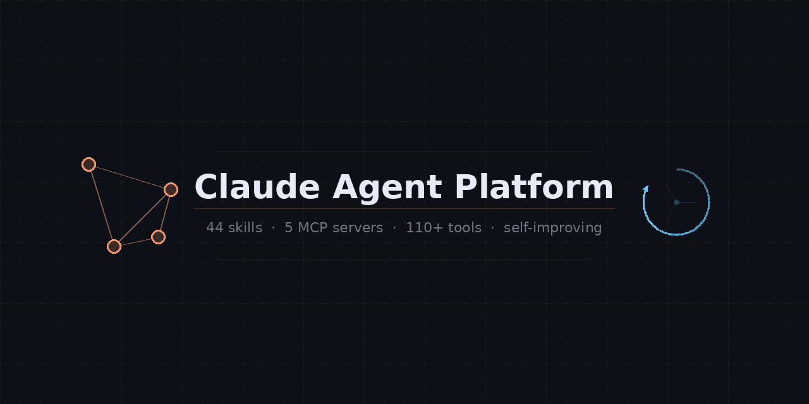
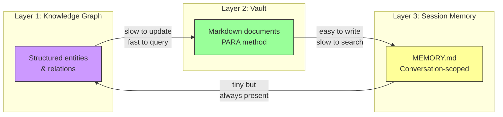
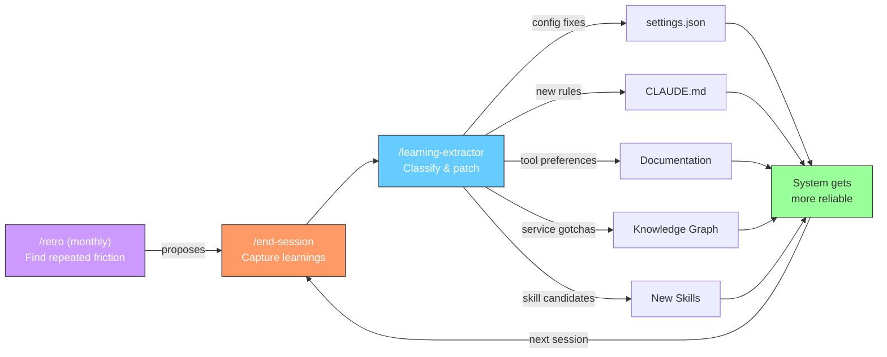

<p align="center">
  
</p>

<h3 align="center">
  From monolithic prompts to a self-improving multi-agent platform
</h3>

<p align="center">
  
  
  
  
  
</p>

<p align="center">
  <a href="ARCHITECTURE.md">Full Write-Up</a> ·
  <a href="#demos">Demos</a> ·
  <a href="#skills">Skills</a> ·
  <a href="examples/memory-architecture.md">Memory Architecture</a>
</p>

---

---

## The Problem

Managing infrastructure, projects, research, and daily operations means juggling dozens of tools, APIs, and manual workflows. A single AI prompt can help with one task. But real work is **multi-step, multi-source, and needs to remember what it learned**.

I started with one big prompt. Six months later, it's a platform.

## The Result

| Before | After |
|--------|-------|
| One monolithic prompt doing everything | **44 composable skills**, each with clear purpose |
| Sequential execution, one task at a time | **Parallel subagent dispatch** — 10 agents in 60 seconds |
| Context lost between sessions | **3-layer persistent memory** (knowledge graph + vault + session) |
| Same mistakes repeated | **Self-improvement loop** — system patches itself |
| Manual tool juggling | **110+ MCP tools** across 5 servers |

---

## Demos

### Research: 4 Parallel Agents → Structured Report

<!-- DEMO: /research command dispatching 4 parallel haiku agents searching different angles,
     results streaming back, parent synthesizing, report saved to vault.
     Target: ~60s asciinema recording or GIF
     Show: the agent dispatch messages, parallel execution, synthesis, file write confirmation
     File: assets/demo-research.gif -->

> `/research open-source billing platforms` → dispatches 4 agents (Practitioner, Skeptic, Economist, Historian) → each searches 2-3 queries → reads top sources → returns structured findings with trust scores → parent deduplicates, flags contradictions, synthesizes → saves to vault

### Morning Briefing: 6 Sources in Parallel

<!-- DEMO: /briefing command fetching weather, meals, calendar, infra health, projects, tasks
     all in parallel, formatted output appearing section by section.
     Target: ~30s asciinema recording or GIF
     Show: parallel MCP tool calls firing, data returning, clean formatted output
     File: assets/demo-briefing.gif -->

> `/briefing` → fetches weather, meals, meetings, infrastructure health, project metrics, open tasks — all in parallel → formats into a scannable morning summary

### Self-Improvement: Learning → System Patch

<!-- DEMO: /end-session capturing learnings, then /learning-extractor classifying them
     into config fixes, operational principles, skill candidates.
     Target: ~45s asciinema recording or GIF
     Show: learning bullets written, classification happening, config patch proposed
     File: assets/demo-self-improvement.gif -->

> `/end-session` → captures what worked and what broke → `/learning-extractor` classifies each learning → proposes config patches, new rules, skill candidates → approved changes applied automatically

---

## How It Works


### The Key Insight: Subagents Gather, Parent Decides

The expensive model (Opus) never wastes tokens on web searches or file scanning. It **plans the work, dispatches cheap/fast subagents (Haiku), and synthesizes their results**. This isn't just a performance optimization — it's an architectural boundary that prevents the wrong model from making the wrong decisions.

| Layer | Model | Role | Cost |
|-------|-------|------|------|
| Parent | Opus | Plan, dispatch, synthesize, decide | High |
| Subagents | Haiku | Search, fetch, scan, gather | Low |
| Tools | MCP | Execute operations on external systems | Free |

---

## Shared State: 3 Layers

Multi-agent coordination requires shared context. Three layers, each optimized for different access patterns:



| Layer | Best For | Written By | Read By |
|-------|----------|-----------|---------|
| **Knowledge Graph** | Facts that change slowly (services, decisions, patterns) | `/end-session`, `/retro` | All skills at session start |
| **Vault** | Detailed documents (reports, research, daily notes) | `/research`, `/briefing`, subagents | Research prior-art checks, briefings |
| **Session Memory** | Routing decisions, preferences, conventions | `/end-session` | Auto-injected every session |

> See [memory-architecture.md](examples/memory-architecture.md) for the full design.

---

## The Self-Improvement Loop

This is the part that makes it compound. The system learns from every session:



**Real example**: Research tasks kept re-searching topics already covered. The learning-extractor flagged the pattern. A "check research index before searching" rule was added to CLAUDE.md. Now the system checks what it knows before hitting the web. Automatically. Every time.

**Another example**: Agents kept hitting permission errors writing to the vault. The extractor proposed a standing permission rule. Applied once, never hits that error again.

---

## Operational Principles

These aren't theoretical. Each one came from a real failure:

<details>
<summary><strong>Separate Explore from Execute</strong></summary>

"Find", "suggest", "research" = **explore mode** (no side effects).
"Request", "download", "deploy" = **execute mode** (has side effects).

**Why**: An agent researching "what if we changed the config?" accidentally changed the config. Now there's a hard boundary: explore mode never crosses into execute without explicit human confirmation.

**How it's enforced**: Skills declare their mode. The parent agent checks before dispatching. MCP tools that mutate state require confirmation gates.
</details>

<details>
<summary><strong>Verify Before Batch</strong></summary>

Never fire off N parallel operations assuming they'll all succeed. Test 1-2 first, inspect results, then batch.

**Why**: A batch book request sent 15 API calls. 12 grabbed study guides instead of novels because the search API does fuzzy matching. Now: test 2, verify titles, then batch the rest.

**How it's enforced**: Batch operations in skills have a mandatory "test phase" before "execute phase."
</details>

<details>
<summary><strong>Check State After Mutation</strong></summary>

After any API call that changes state, verify the resulting state. Don't trust "OK" responses.

**Why**: An `addAuthor` API returned 200 OK but silently set the author to "Paused" status. Nothing happened until someone checked. Now: every mutation is followed by a verification query.
</details>

<details>
<summary><strong>Know the Layer Below</strong></summary>

Every MCP tool wraps an API. When the tool returns unexpected results, drop to the raw API.

**Why**: An MCP book search tool grabbed the wrong edition 50% of the time. The underlying API had a `findBook` endpoint with better filtering. Document both paths — the MCP shortcut AND the direct API fallback.
</details>

---

## Skills

6 representative skills from the full library of 44:

| Skill | What It Does | Key Pattern |
|-------|-------------|-------------|
| [/research](skills/research/) | Multi-engine web research across 3 depth modes | Parallel subagent dispatch with structured output contracts and mechanical trust scoring |
| [/briefing](skills/briefing/) | Morning briefing from 6+ parallel data sources | Graceful degradation — one source failing doesn't block the rest |
| [/end-session](skills/end-session/) | Captures learnings and syncs all state | Entry point for the self-improvement loop. Fast (2 min) and full (8 min) modes |
| [/learning-extractor](skills/learning-extractor/) | Classifies learnings into system patches | 6 categories: config fixes, principles, tool preferences, gotchas, skill candidates, noise |
| [/retro](skills/retro/) | Monthly review of all session friction | Finds repeated patterns, proposes automations, prunes stale data, audits decisions |
| [/focus](skills/focus/) | Timed work sprints with escalating boundaries | Background timer → terminal nudge → push notification → forced wrap-up with auto-logging |

<details>
<summary><strong>The other 38 skills</strong></summary>

Deployment, infrastructure auditing, service health checks, container management, backup orchestration, bookmark digestion, book pipeline management, knowledge graph export, daily planning reviews, project tracking, meeting prep, product research, service onboarding, configuration auditing, PR review, feature scaffolding, shipping workflows, log viewing, messaging, and more.

Each follows the same pattern: clear purpose, defined inputs/outputs, failure modes documented, composable through shared state.
</details>

---

## The Automation Layer

The skills above are the interactive side. Behind them: **60+ automated workflows** running 24/7 on a self-hosted n8n instance, handling everything that should happen without a human in the chair.

| Workflow Family | Count | What It Does |
|---|---|---|
| Morning Briefing | 7 | 6 parallel data sources (weather, meals, calendar, tasks, project metrics, health) merged into one briefing |
| Event Classification | 5 | Routes webhook and service events into categories for downstream processing |
| Communication Bridges | 5 | Gmail, Google Drive, Dropbox, Calendar sync to local systems |
| Intelligence Digests | 7 | Daily dev news, weekly meeting summaries, notification routing |
| Monitoring | 6 | Service health alerts, container status, disk usage thresholds |
| Infrastructure | 5 | System health, session indexing, decision decay tracking |
| Knowledge/Content | 8 | Vault Q&A, domain-specific RAG, book requests, media requests |

The two layers share state through the vault, knowledge graph, and MCP tools. A signal captured by an automated workflow at 3am shows up in the morning briefing at 7am and surfaces in the Claude Code session at 9am.

> See [automation-layer.md](examples/automation-layer.md) for the full architecture.

---

## Design Patterns

Reusable architectural patterns extracted from building this system:

| Pattern | Problem It Solves | Doc |
|---|---|---|
| [Compound Loop](patterns/compound-loop.md) | Sessions don't learn from each other | Self-improving feedback: capture, classify, apply, review |
| [Parallel Agent Dispatch](patterns/parallel-agent-dispatch.md) | Research is slow and expensive | Cheap models gather, expensive models decide |
| [Session Hooks](patterns/session-hooks.md) | Agents forget safety rules | Lifecycle hooks enforce behavior mechanically |
| [Context Engineering](patterns/context-engineering.md) | Context windows fill up fast | 3-layer architecture: graph, documents, session memory |

These patterns aren't theoretical. Each one emerged from a real failure in this system and has been running in production for months.

---

## What I'd Build Next

Everything here is single-operator. The hardest unsolved problem is **multi-user coordination** -- different people with different permissions, different views, different triggers, sharing the same state layer.

The foundation supports it: composable skills, tiered orchestration, external shared state, self-improvement loops. What's missing is the coordination layer that lets a team of humans interact with a team of agents.

That's the problem I want to solve next.

---

## About

I'm a fullstack engineer (React/TypeScript/Node.js/AWS) who built this system over six months across 400+ Claude Code sessions to solve a real problem: managing homelab infrastructure, research, and operations across dozens of tools and APIs without losing context between sessions.

The patterns here aren't theoretical. Each one emerged from a real failure, got encoded into the system, and has been running in production for months. The compound loop architecture, the parallel agent dispatch model, the context engineering approach -- these are extracted from a working system I operate daily.

If these patterns are interesting to you, I'd enjoy the conversation.

[LinkedIn](https://www.linkedin.com/in/jtmchorse/) | jmchorse@gmail.com

---

## Project Structure

```
claude-agent-platform/
├── README.md                          # You are here
├── ARCHITECTURE.md                    # Full narrative: monolith -> platform
├── patterns/
│   ├── compound-loop.md               # Self-improving feedback architecture
│   ├── parallel-agent-dispatch.md     # Tiered model selection for multi-agent work
│   ├── session-hooks.md               # Lifecycle hooks as behavioral guardrails
│   └── context-engineering.md         # 3-layer context management architecture
├── skills/
│   ├── research/SKILL.md              # Parallel subagents, trust scoring
│   ├── briefing/SKILL.md              # Parallel fetch, graceful degradation
│   ├── end-session/SKILL.md           # Learning capture, self-improvement entry
│   ├── learning-extractor/SKILL.md    # Learning -> system patch classification
│   ├── retro/SKILL.md                 # Monthly friction -> protocol
│   └── focus/SKILL.md                 # Timed sprints, escalating boundaries
├── examples/
│   ├── CLAUDE.md                      # Genericized operational principles
│   ├── memory-architecture.md         # 3-layer shared state design
│   └── automation-layer.md            # 60+ n8n workflows: the always-on layer
└── assets/
    └── claude-agent-platform-banner.png
```

---

<p align="center">
  <sub>Built across 400+ sessions with <a href="https://claude.ai/code">Claude Code</a>, 5 MCP servers, 60+ n8n workflows, and a Supermicro 1U that refuses to quit.</sub>
</p>
